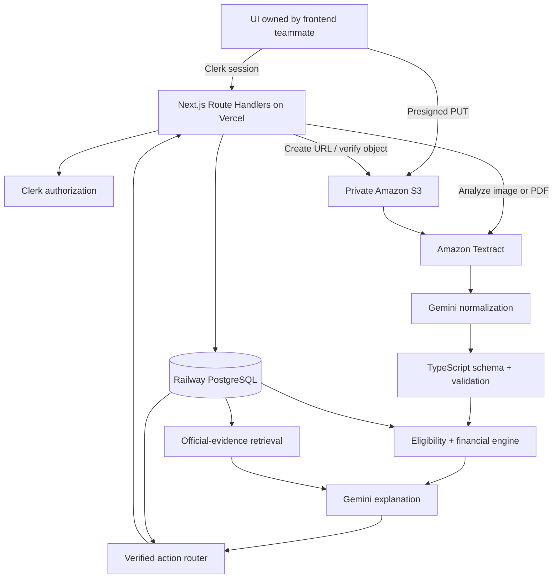

# Greenlight Backend Product Requirements

**Status:** Build specification
**Updated:** 2026-08-15
**Initial market:** Ontario, Canada
**Product input:** Utility-bill image or PDF
**Primary owner:** Backend/API team

## 1. Product summary

Greenlight turns a utility bill into a trustworthy, money-saving next step. A user uploads a bill; Greenlight extracts the facts, matches them against current official programs, calculates eligibility and financial value, explains the result, and routes the user to the verified application channel.

The product promise is:

> Scan → verify → calculate → act.

Greenlight is not a chatbot and not a generic OCR demo. Its differentiator is completing the bureaucratic work between finding an opportunity and taking the correct action.

## 2. Decisions that override older plans

- Build one full-stack **Next.js TypeScript** application.
- Deploy the application and its Route Handler APIs to **Vercel**.
- Use **Clerk** for authentication and server-side authorization.
- Use **Railway PostgreSQL** as the canonical relational database.
- Use **private Amazon S3** for uploads and source snapshots.
- Use **Amazon Textract** for OCR, confidence, page, and evidence coordinates.
- Use **Gemini** only for OCR normalization, explanations, and route-specific drafting.
- Do not add Python, FastAPI, FastMCP, Expo, Lambda, API Gateway, Step Functions, DynamoDB, or a separate backend service for the MVP.
- Do not implement frontend pages or visual design in this workstream; a teammate owns UI. The backend must expose stable contracts for that teammate.

Next.js Route Handlers provide custom HTTP handlers inside the App Router, so a separate API framework is unnecessary for this scope ([Next.js Route Handler reference](https://nextjs.org/docs/app/building-your-application/routing/route-handlers)). Vercel deploys dynamic Next.js code as Vercel Functions and supports the Node.js runtime required by the AWS, Clerk, database, and Gemini SDKs ([Vercel runtimes](https://vercel.com/docs/functions/runtimes)).

## 3. Users and problem

### Primary user

An Ontario resident who receives an electricity or other utility bill and wants to reduce costs without researching program rules, rate plans, administrators, and application routes.

### Problems Greenlight solves

- Bills are difficult to interpret and compare fairly across billing periods.
- Assistance and retrofit programs have changing thresholds and routes.
- Users cannot tell which recommendations are verified, conditional, or estimated.
- Finding a program does not tell a user how to apply.
- Generic AI can invent dollar amounts, eligibility confidence, or contact information.

## 4. Product principles

1. **AI explains; code calculates.** Gemini never creates an eligibility result or dollar amount.
2. **Evidence before confidence.** Every material extracted field and recommendation links to bill evidence or a versioned official source.
3. **Unknown stays unknown.** A bill does not prove which appliance caused an increase.
4. **Financial categories stay separate.** Credits, grants, rebates, operating estimates, no-cost upgrades, financing, and upfront costs are never merged into a misleading total.
5. **Official route only.** Greenlight never invents a recipient, department, URL, phone number, or intake agency.
6. **User approval is mandatory.** The system may prepare an action but may not submit or send it without explicit approval.
7. **Collect less.** Keep only the personal data required for the current case and delete raw demo documents automatically.

## 5. MVP scope

### Required

- Authenticated case ownership with Clerk.
- JPEG, PNG, and single-page PDF intake for the MVP.
- Direct browser-to-S3 upload using a short-lived presigned URL.
- Private S3 object storage with random object keys and automatic expiration.
- Textract extraction of provider, billing period, billing days, total due, usage, rate plan when present, and service postal prefix.
- Page/bounding-box evidence and confidence for extracted fields.
- User confirmation for low-confidence or conflicting critical fields.
- Gemini normalization into a validated canonical bill schema.
- Versioned registry for at least OESP, EAP, LEAP, Home Renovation Savings, and Toronto HELP.
- Deterministic eligibility and financial calculations.
- Retrieval of official evidence using metadata and full-text search.
- One highest-value missing question at a time.
- Verified route resolution for portal, form, phone, mail, intake agency, or email.
- Structured JSON responses for the UI teammate.
- Live, hybrid, and demo execution modes.

### Explicitly out of scope

- Frontend layout, components, design system, or animation.
- Native mobile application.
- General-purpose agent framework.
- Automated government-site crawler.
- Automatic email sending or form submission.
- Multi-province support.
- Smart-meter or device-level attribution.
- Bedrock Knowledge Bases or vector search before the official-source corpus outgrows PostgreSQL search.
- Multi-page PDF processing before the single-page demo path is reliable.

## 6. User journey and system behavior

1. Clerk authenticates the user.
2. `POST /api/cases` creates a case owned by the Clerk user ID.
3. `POST /api/uploads` validates proposed file metadata and returns a short-lived S3 `PUT` URL.
4. The browser uploads directly to a private S3 key scoped to the case.
5. `POST /api/documents/{documentId}/analyze` verifies the object and starts extraction.
6. Textract returns OCR blocks, queries, confidence, pages, and coordinates.
7. Gemini normalizes only the minimized OCR payload into the canonical bill schema.
8. Backend validation reconciles dates, units, totals, and confidence. Uncertain critical fields enter `needs_review`.
9. The rule engine filters current programs by jurisdiction, provider, effective date, and household facts.
10. The engine asks the single missing question that resolves the most candidates.
11. Deterministic code computes eligibility and value components.
12. Retrieval finds supporting official excerpts for the exact program version and rule.
13. Gemini explains the already-computed result in structured JSON.
14. The action router resolves the current official destination and prepares the appropriate checklist, call script, form packet, or email draft.
15. The user reviews and approves before leaving Greenlight or executing any supported action.

## 7. Architecture



S3 presigned URLs provide time-limited upload access without giving the browser AWS credentials ([AWS S3 presigned URLs](https://docs.aws.amazon.com/AmazonS3/latest/userguide/using-presigned-url.html)). Direct upload also avoids Vercel Functions' request/response body limit ([Vercel Function limits](https://vercel.com/docs/functions/limitations)). Textract supports document analysis with text, forms, tables, queries, and layout; query results include confidence and location information ([Textract document analysis](https://docs.aws.amazon.com/textract/latest/dg/how-it-works-analyzing.html), [Textract Queries](https://docs.aws.amazon.com/textract/latest/dg/queryresponse.html)). Multi-page PDFs require Textract's asynchronous workflow and are therefore deferred from the MVP ([Textract asynchronous operations](https://docs.aws.amazon.com/textract/latest/dg/api-async.html)).

## 8. Backend modules

Keep modules as ordinary TypeScript folders in the single application. No interface is required until there is a second real implementation.

### Uploads

- Accept declared MIME types `image/jpeg`, `image/png`, and `application/pdf` only.
- Enforce a configurable size limit before signing and again after upload.
- Generate an unguessable key; never reuse a user filename as the key.
- Bind the expected content type and checksum to the signed request.
- Verify file signature/magic bytes before OCR.
- Never return permanent object URLs.

### Extraction

- Use Textract queries for targeted bill fields and retain raw line blocks for fallback matching.
- Persist only the evidence coordinates and minimized normalized fields required by the case.
- Treat confidence as input to review logic, not truth. AWS recommends higher thresholds and human scrutiny for financially sensitive workflows ([Textract best practices](https://docs.aws.amazon.com/textract/latest/dg/textract-best-practices.html)).
- Default critical-field review threshold: configurable, initially `90`.
- A conflict between OCR, validation, and Gemini always requires review even above the threshold.

### Gemini

Use the current official JavaScript/TypeScript SDK, `@google/genai`, and schema-constrained structured output ([Google GenAI SDK](https://ai.google.dev/gemini-api/docs/libraries), [Gemini structured output](https://ai.google.dev/gemini-api/docs/structured-output)). Keep the model identifier configurable rather than embedding a preview model name in business logic.

Do not use Gemini's built-in Google Search as the program knowledge base. Retrieval must use Greenlight's reviewed official-source snapshots so the application controls versions, citations, and eligibility inputs.

Gemini may:

- normalize OCR fields;
- classify ambiguities;
- explain deterministic results using supplied evidence;
- draft route-specific human language.

Gemini may not:

- calculate or alter benefits;
- decide eligibility;
- create contacts or source claims;
- execute external actions;
- receive unmasked account numbers or unnecessary raw OCR.

### Program registry and evidence retrieval

PostgreSQL is the canonical source for structured program data. Each update creates a new `program_version`; old rules and source snapshots remain auditable.

The MVP RAG flow is:

```text
official source snapshot
  → normalized source chunks in PostgreSQL
  → jurisdiction/effective-date/program metadata filter
  → PostgreSQL full-text ranking
  → top supporting excerpts
  → Gemini explanation with source IDs
```

This is retrieval-augmented generation without an additional vector service. Add pgvector or Bedrock Knowledge Bases only when measured retrieval failures show that full-text search is insufficient.

Every source chunk records:

- source URL and authority;
- retrieval timestamp and content hash;
- effective start/end when known;
- jurisdiction and program version;
- exact excerpt used as evidence.

Never overwrite a current rule until a human has reviewed the new official source.

### Eligibility engine

Rule results are `pass`, `fail`, `unknown`, or `manual_review`.

- A failed required rule produces `ineligible`.
- Any required manual-review rule produces `manual_review`.
- All required rules passing produces `eligible`.
- Missing required answers produce `likely_eligible` or `possible_match`, based on evidence coverage—not an AI probability.

User-facing output reports confirmed, failed, and missing requirements. It must never display an invented percentage confidence.

### Financial engine

- Normalize usage by billing days before comparing periods.
- Calculate recurring credits from the official table/formula for the selected program version.
- Cap grants and rebates using official conditions.
- Calculate rate-shifting only when period-specific usage and current official rates are available.
- Label modeled energy savings as estimated.
- Store financing separately and exclude principal from savings totals.
- Subtract upfront costs when reporting net benefit.

Every value component includes type, cadence, minimum/maximum, certainty, whether it contributes to a savings total, formula version, and source version.

### Action router

Supported route types:

- `official_portal`
- `web_form`
- `phone`
- `mail`
- `intake_agency`
- `email`
- `utility_election_form`
- `manual_review`

If a verified route is unavailable or stale, show the official source and set `manual_review`; do not fall back to a generated contact.

Ontario's official program pages demonstrate why route type matters: OESP supports online, mail, and intake-agency applications; LEAP requires an intake agency; EAP offers a form/phone route and authorized regional delivery agents ([OESP](https://oeb.ca/consumer-information-and-protection/bill-assistance-programs/ontario-electricity-support-program), [LEAP](https://www.oeb.ca/consumer-information-and-protection/bill-assistance-programs/low-income-energy-assistance-program), [EAP](https://saveonenergy.ca/en/For-Your-Home/Energy-Affordability-Program)). Toronto HELP is financing and must never be counted as savings ([City of Toronto HELP](https://www.toronto.ca/services-payments/water-environment/environmental-grants-incentives/home-energy-loan-program-help/)).

## 9. API contract

All mutating and case-reading endpoints require server-side Clerk authorization. Clerk's Next.js SDK supports App Router server helpers and Route Handlers ([Clerk Next.js SDK](https://clerk.com/docs/reference/nextjs/overview)). Use the session's Clerk user ID as the ownership key; do not build a user-sync webhook unless the product later needs queryable user profiles.

| Method | Route | Purpose |
|---|---|---|
| `POST` | `/api/cases` | Create owned analysis case |
| `POST` | `/api/uploads` | Validate metadata and create S3 upload URL |
| `POST` | `/api/documents/{id}/analyze` | Verify ownership/object and start OCR |
| `GET` | `/api/cases/{id}/status` | Return processing state and recoverable errors |
| `PATCH` | `/api/documents/{id}/fields` | Confirm or correct extracted fields |
| `POST` | `/api/cases/{id}/answers` | Record minimum household answers and re-evaluate |
| `GET` | `/api/cases/{id}/result` | Return findings, values, and evidence |
| `POST` | `/api/opportunities/{id}/prepare` | Resolve route and prepare next action |
| `POST` | `/api/actions/{id}/approve` | Record explicit user approval |

Every response uses a stable envelope:

```json
{
  "data": {},
  "error": null,
  "requestId": "uuid"
}
```

The result payload supplies the UI contract without prescribing its design:

```json
{
  "caseId": "uuid",
  "status": "ready",
  "bill": { "fields": [], "evidence": [] },
  "opportunities": [
    {
      "programVersionId": "string",
      "eligibility": "likely_eligible",
      "confirmedRequirements": [],
      "missingRequirements": [],
      "values": [],
      "evidence": [],
      "actionRoute": { "type": "official_portal", "verified": true }
    }
  ],
  "nextQuestion": null
}
```

Errors use a machine-readable code, safe user message, retryability flag, and never include secrets, raw OCR, account numbers, SQL, or upstream response bodies.

## 10. Processing states

```text
created → upload_ready → uploaded → extracting → normalizing
        → needs_review → evaluating → retrieving_evidence
        → explaining → ready → action_prepared → approved
```

Terminal/recoverable failures include:

- `invalid_file`
- `ocr_failed`
- `ocr_review_required`
- `missing_information`
- `program_data_stale`
- `official_route_unverified`
- `upstream_rate_limited`
- `processing_failed`

State transitions must be idempotent so polling or retrying a request cannot duplicate cases, OCR jobs, evaluations, or actions.

## 11. Minimum data model

```text
cases
documents
extracted_fields
case_answers
programs
program_versions
eligibility_rules
benefit_rules
program_sources
source_chunks
action_routes
case_program_evaluations
value_components
evidence_items
prepared_actions
audit_events
```

`cases` stores `clerk_user_id`; child records reference the case, and every lookup joins through the owned case. Railway provides PostgreSQL connection variables including `DATABASE_URL`. Because Vercel-to-Railway is an external cross-provider database connection, keep regions close, use a bounded serverless-safe connection pool, and account for TCP-proxy egress ([Railway PostgreSQL](https://docs.railway.com/databases/postgresql), [Vercel runtimes](https://vercel.com/docs/functions/runtimes)).

## 12. Security and privacy requirements

- Protect every user-owned resource with both authentication and ownership checks.
- Use a private S3 bucket with public access blocked.
- Use least-privilege AWS permissions scoped to the Greenlight bucket and required Textract calls.
- Prefer Vercel OIDC federation for short-lived AWS credentials; Vercel supports exchanging its OIDC token for AWS credentials, avoiding persistent AWS keys in deployment variables ([Vercel OIDC](https://vercel.com/docs/oidc), [Vercel AWS credentials provider](https://vercel.com/docs/oidc/reference)).
- Store Clerk, Gemini, database, and fallback AWS secrets only in server-side environment variables.
- Never prefix secrets with `NEXT_PUBLIC_`.
- Validate MIME type, magic bytes, checksum, and size at the trust boundary.
- Mask account numbers before persistence beyond extraction and before Gemini.
- Never log raw documents or raw OCR text.
- Add an S3 lifecycle rule for raw-demo upload expiration; S3 Lifecycle supports object expiration rules ([AWS S3 lifecycle](https://docs.aws.amazon.com/AmazonS3/latest/userguide/object-lifecycle-mgmt.html)).
- Provide case/document deletion and an auditable reset-demo operation.
- Use synthetic or manually redacted documents for the hackathon.

Do not send personal utility bills through unpaid Gemini services. Google's current terms say not to submit sensitive, confidential, or personal information to unpaid services and state that human reviewers may process unpaid-service inputs and outputs ([Gemini API terms](https://ai.google.dev/gemini-api/terms)). Production processing of real bills requires approved paid/enterprise data terms and a documented privacy review.

## 13. Environments and deployment

Use separate development, preview, and production settings.

Required server configuration names:

```env
DATABASE_URL=

NEXT_PUBLIC_CLERK_PUBLISHABLE_KEY=
CLERK_SECRET_KEY=

AWS_REGION=
AWS_S3_BUCKET=
AWS_ROLE_ARN=

GEMINI_API_KEY=
GEMINI_MODEL=

APP_URL=
EXECUTION_MODE=live
UPLOAD_MAX_BYTES=
PRESIGNED_UPLOAD_TTL_SECONDS=600
DEMO_DOCUMENT_TTL_HOURS=24
OCR_REVIEW_CONFIDENCE=90
```

`EXECUTION_MODE` is server-only. Do not use `NEXT_PUBLIC_DEMO_MODE`, because a client-controlled flag must not choose trusted backend behavior.

Infrastructure responsibilities:

- **Vercel:** Next.js build, server functions, domain, deployment variables, logs.
- **Railway:** PostgreSQL, connection string, backups/restore policy, database monitoring.
- **Clerk:** development and production instances, allowed origins, session configuration.
- **AWS:** private S3 bucket, CORS limited to approved app origins, lifecycle rule, Textract permissions, Vercel OIDC trust role.
- **Gemini:** paid/approved API project for real data; free-tier use limited to synthetic/redacted demo data.

This PRD does not authorize provisioning or changing cloud resources; credentials, billing scope, regions, and production domains must be confirmed during implementation.

## 14. Resilience modes

| Mode | Upload/OCR | Rules | Explanation | Purpose |
|---|---|---|---|---|
| `live` | S3 + Textract | Live deterministic engine | Live Gemini | Normal operation |
| `hybrid` | S3 + Textract | Live deterministic engine | Cached approved narrative | Gemini outage/rate limit |
| `demo` | Synthetic saved extraction | Live deterministic engine | Saved narrative | Stage/Wi-Fi failure |

All modes must exercise the same schemas, rule engine, evidence links, and action router. The demo fallback must not silently replace a live user document; mode and fixture use are explicit in server logs and case metadata.

## 15. Acceptance criteria

- [ ] An authenticated user can create and access only their own case.
- [ ] A valid image or single-page PDF uploads directly to private S3 through a short-lived URL.
- [ ] Invalid type, signature, checksum, or size is rejected before OCR.
- [ ] Textract extracts provider, period, billing days, total, usage, and postal prefix from the demo bill.
- [ ] Each extracted critical value retains page/coordinate evidence and confidence.
- [ ] Low-confidence or conflicting values require confirmation.
- [ ] No full account number or raw OCR text reaches Gemini or logs.
- [ ] At least five Ontario programs have versioned official sources, rules, benefits, and routes.
- [ ] Eligibility and dollar values are reproducible without Gemini.
- [ ] Financing is excluded from savings totals.
- [ ] Every recommendation cites the exact official source version used.
- [ ] The system asks one high-value missing question rather than a long form.
- [ ] At least one route resolves end-to-end to a verified official destination.
- [ ] No external action occurs before explicit user approval.
- [ ] Live, hybrid, and demo modes return the same response contracts.
- [ ] The backend supports a complete stage flow in under three minutes.

## 16. Delivery order

1. Next.js server foundation, Clerk authorization, Railway schema.
2. S3 presigned upload and file validation.
3. Textract extraction, evidence mapping, and review state.
4. Canonical bill schema and Gemini normalization.
5. Versioned Ontario program seeds and deterministic engines.
6. Official-evidence retrieval and citations.
7. Action router and approval audit.
8. Hybrid/demo fixtures and end-to-end verification.

## 17. Source inputs

- [Shared Greenlight product conversation](https://chatgpt.com/share/6a80a105-f254-83ea-8823-76f4906f1449)
- [Greenlight build brief](./Greenlight_Ultimate_Claude_Code_Prompt%20%281%29.pdf)
- The official technical and Ontario-program sources linked inline throughout this document.
